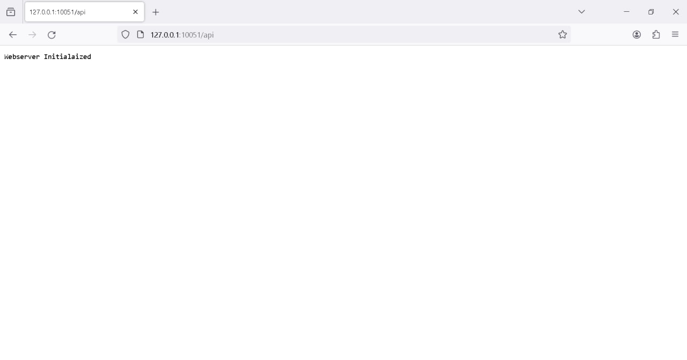
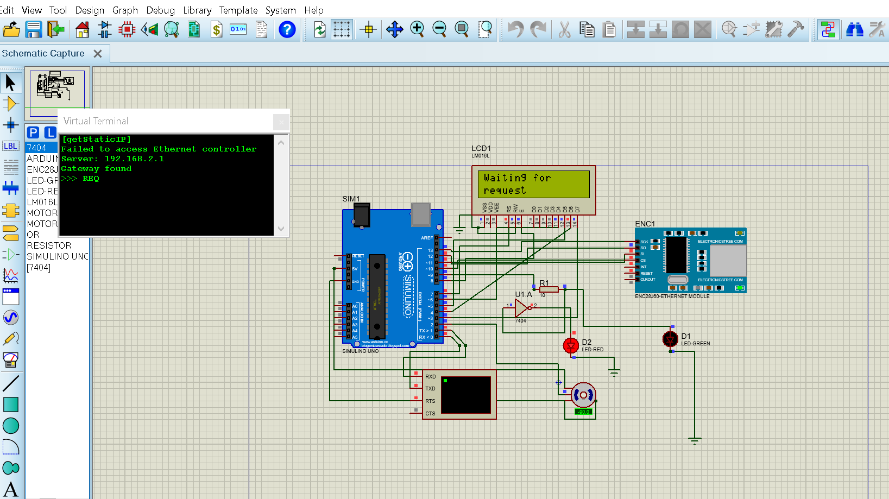
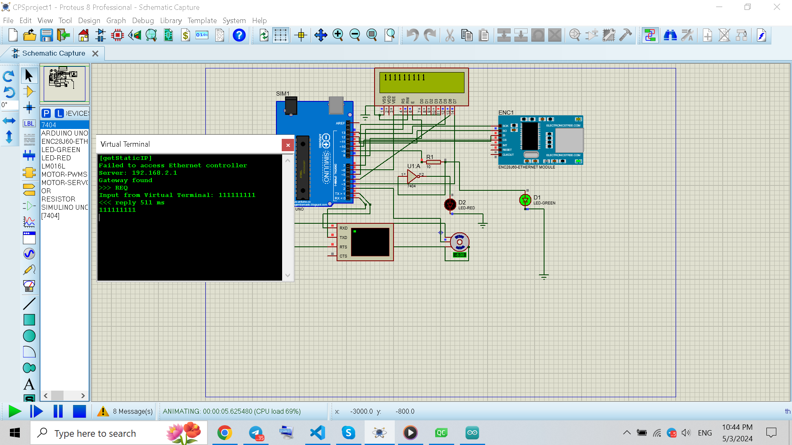
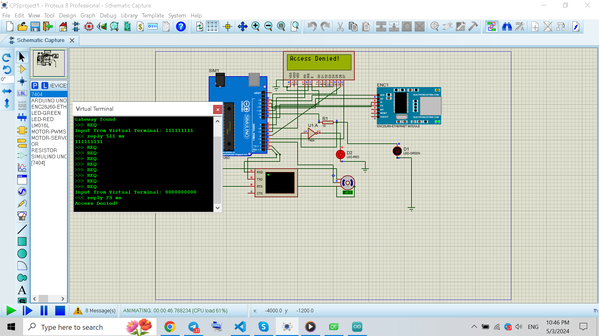
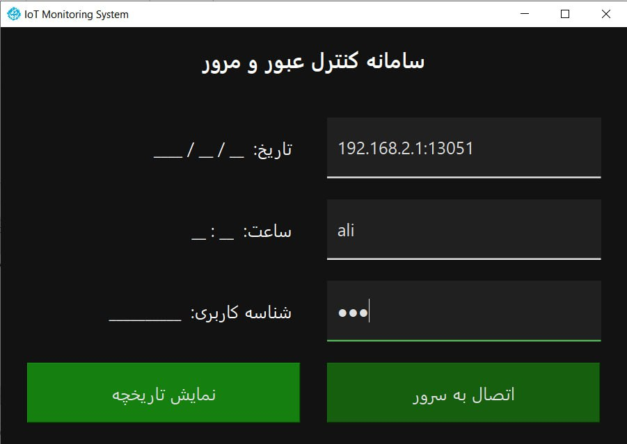
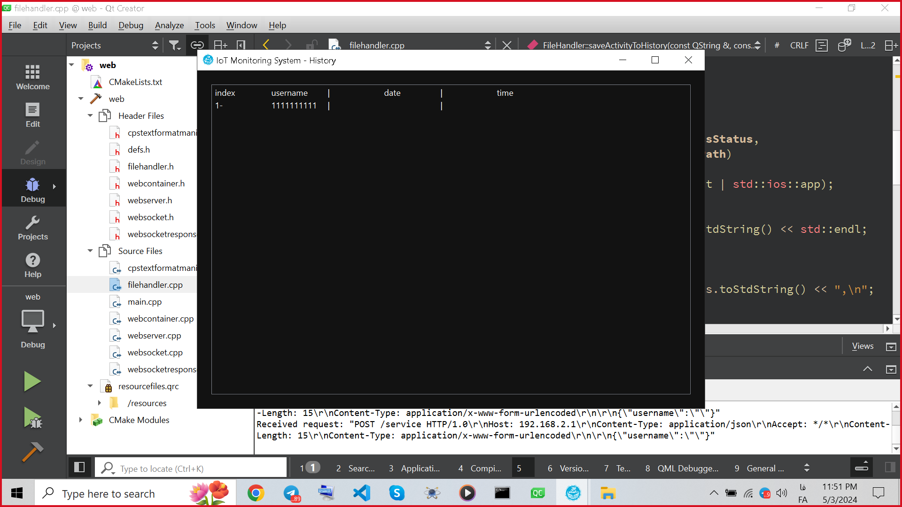
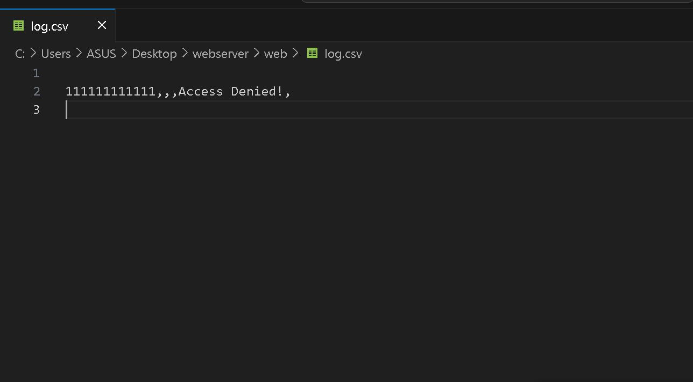

# Cyber-Physical-Systems-Course-Projects

### Web server:

The web server is implemented using the QTcpserver class, which makes it possible to run a web server on the local host with a desired port with a socket.

Running Webserver Initialized on port **10051** and the desired API **/api**:

It is also possible to listen non-blocking web server on different ports and answer requests from the Arduino board (which is actually the Ethernet module), or from the monitoring software. Also, filehandler classes have been created to handle and determine the use of the **ValidRfid.csv** and **userinfo.csv** files, which ensure the correctness of the information sent from the monitoring board or software.

### Arduino board and ENC28J60 module:

By creating the MAC address and IP on the ENC28J60 module, it can be used as a network card to create an HTTP request with the POST method through a loopback connection or gateway and send the request to the web server.

By running the Arduino code and entering the information through the virtual terminal in Proteus, you can enter the information and if it is correct, the green LED light will turn 90 degrees and the reply time will be printed on the terminal:

 

And if it is wrong, the light will be red and the message Access Denied will be printed on the screen + reply time:

### GUI Monitoring Software:

Using the monitoring software, we save the program logs and exchanged information in the logs.csv file and also save the sending history in history.csv, which shows the login history of people by pressing the display button:

and display history : 

We can also see the logs in the logs.csv file, which people requested the server : 

